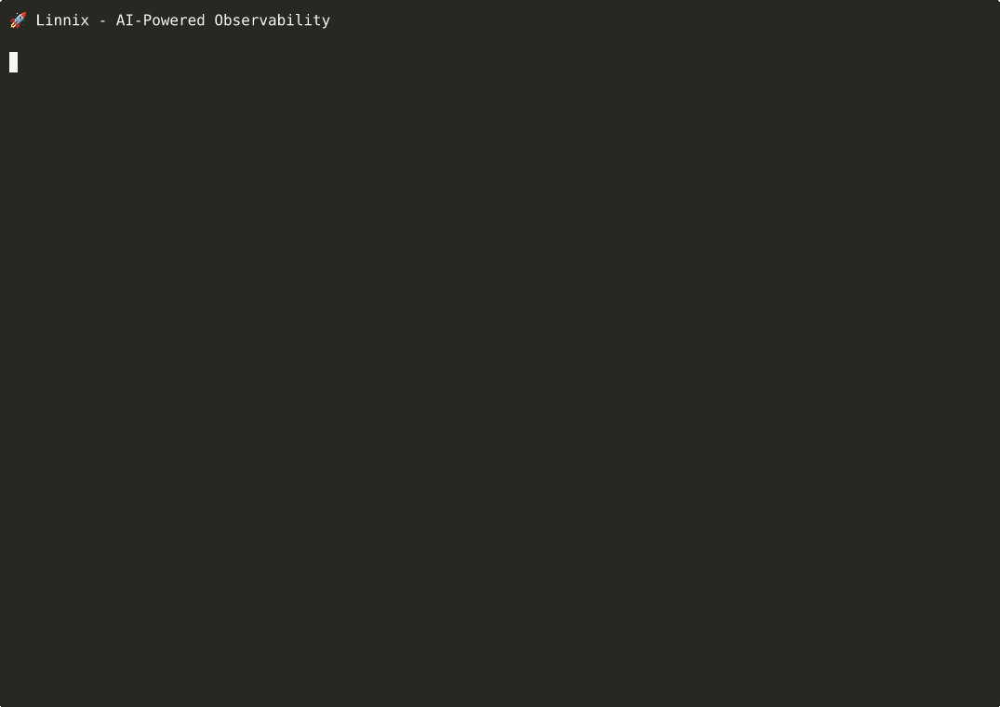

# Linnix

**Catches system failures before they crash your server.**

[](https://github.com/linnix-os/linnix/actions/workflows/docker.yml)
[](LICENSE)
[](https://github.com/linnix-os/linnix/pkgs/container/cognitod)
[](https://github.com/linnix-os/linnix)

---

## Try It Now (30 seconds)

```bash
git clone https://github.com/linnix-os/linnix.git && cd linnix
./quickstart.sh
```

**Watch Linnix detect 3 system failures in real-time:**
- 🔴 **Memory leak** → caught before OOM killer
- 🔴 **Fork bomb** → detected before system hang
- 🔴 **FD exhaustion** → alerted 15s before crash

All with **<1% CPU overhead** using eBPF.

<p align="center">
  
</p>

**Dashboard:** http://localhost:3000 | **API:** http://localhost:3000/alerts

---

## What Just Happened?

Linnix caught 3 different failures **30-60 seconds before crash**:

| Scenario | Detection | Time Saved |
|----------|-----------|------------|
| Memory leak | 60MB/10s growth | ~15s before OOM |
| Fork bomb | 48 forks/sec caught | ~30s before hang |
| FD exhaustion | Alerted at 120/256 FDs | ~15s before crash |

**How?** eBPF monitors at the kernel level (fork, exec, exit events). Rules engine analyzes patterns and alerts before failure.

See detailed scenarios: [`scenarios/README.md`](scenarios/README.md)

---

## Installation (After Demo)

### Docker (Recommended)

```bash
git clone https://github.com/linnix-os/linnix.git && cd linnix
docker-compose up -d
```

- **Dashboard:** http://localhost:3000
- **API:** http://localhost:3000/alerts
- **Prometheus:** http://localhost:3000/metrics

### Native Install (Ubuntu 22.04+)

```bash
# eBPF monitoring only
curl -fsSL https://raw.githubusercontent.com/linnix-os/linnix/main/install-ec2.sh | sudo bash

# Optional: Add local LLM
wget https://raw.githubusercontent.com/linnix-os/linnix/main/install-llm-native.sh
sudo ./install-llm-native.sh
```

**Requirements:**
- Linux 5.8+ with BTF enabled (`ls /sys/kernel/btf/vmlinux`)
- Docker (for containerized deployment)
- 2+ vCPU, 4GB+ RAM (8GB if using LLM)

**Uninstall:**
```bash
sudo systemctl stop linnix-cognitod
sudo systemctl disable linnix-cognitod
sudo rm /etc/systemd/system/linnix-cognitod.service
```

---

## What Linnix Does

### Core Monitoring (eBPF)

Monitors at the kernel level using eBPF:
- Process lifecycle: fork, exec, exit
- CPU/memory telemetry from scheduler
- File descriptor tracking
- Network connection monitoring

**<1% CPU overhead** - no polling `/proc`, direct kernel events via perf buffers.

### Detection (Rules Engine)

Built-in pattern detection catches:
- **Fork storms** - rapid process spawning (>10/sec)
- **Memory leaks** - gradual RSS growth (>50MB/10s)
- **CPU thrashing** - processes stuck in loops
- **FD exhaustion** - files not closed (approaching limit)

### Optional: Local LLM Analysis

- Runs llama.cpp with 3B quantized model
- Analyzes patterns the rules engine flags
- **Completely optional** - rules engine works standalone
- No external API calls (privacy-first)

---

## Architecture

```
┌──────────────────────────────────────────────────────────────┐
│                    Kernel Space (eBPF)                       │
├──────────────────────────────────────────────────────────────┤
│  fork hook  →  exec hook  →  exit hook  →  CPU/mem sampling  │
└────────────────────────┬─────────────────────────────────────┘
                         │ Perf buffers
                         ▼
┌──────────────────────────────────────────────────────────────┐
│                   User Space (cognitod)                      │
├──────────────────────────────────────────────────────────────┤
│  • Event processing    • Process tree tracking               │
│  • State management    • Rules engine                        │
│  • HTTP/SSE API        • Prometheus metrics                  │
└────────────────────────┬─────────────────────────────────────┘
                         │
         ┌───────────────┼───────────────┐
         │               │               │
         ▼               ▼               ▼
   ┌─────────┐    ┌──────────┐   ┌─────────────┐
   │ CLI     │    │ LLM      │   │ Prometheus  │
   │ Stream  │    │(Optional)│   │ Grafana     │
   └─────────┘    └──────────┘   └─────────────┘
```
